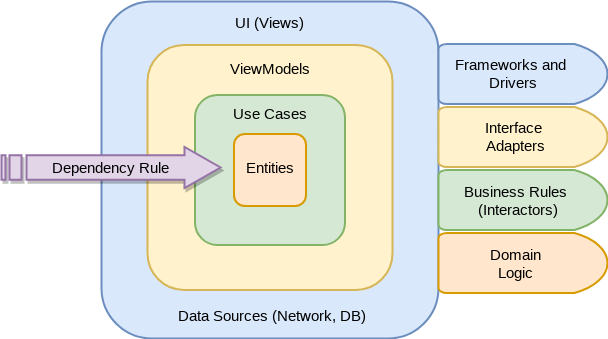
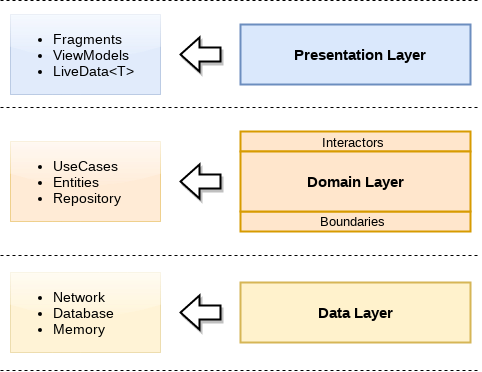
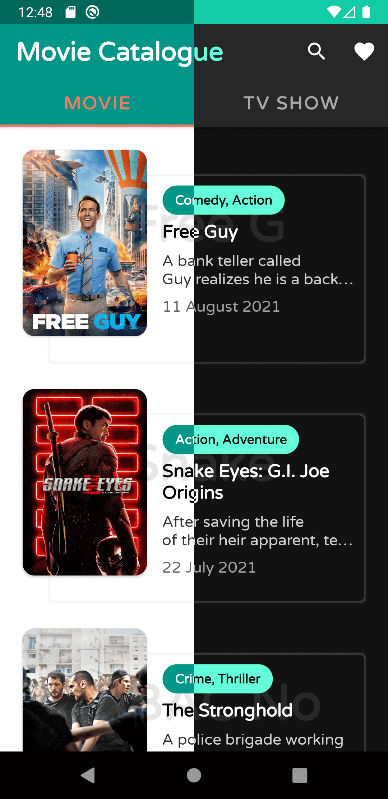
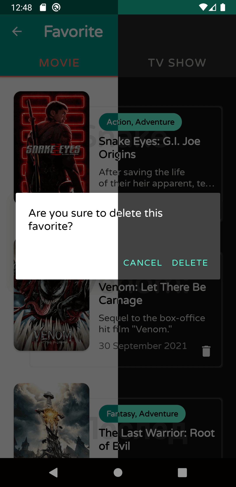
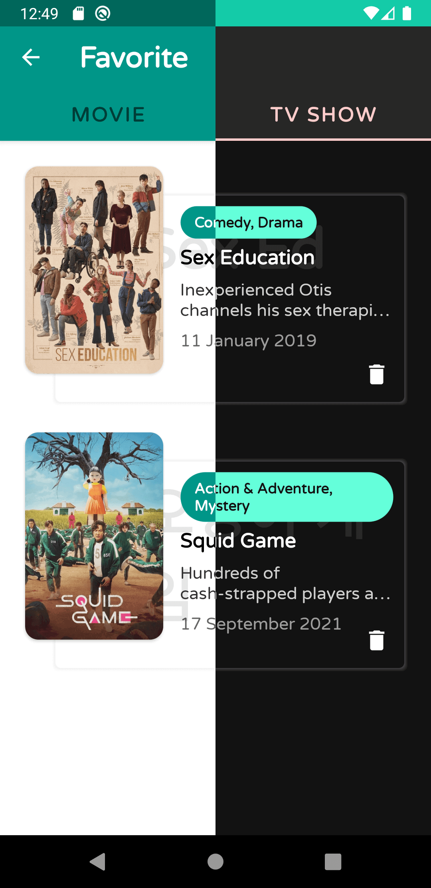
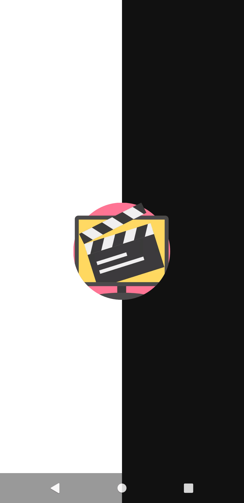
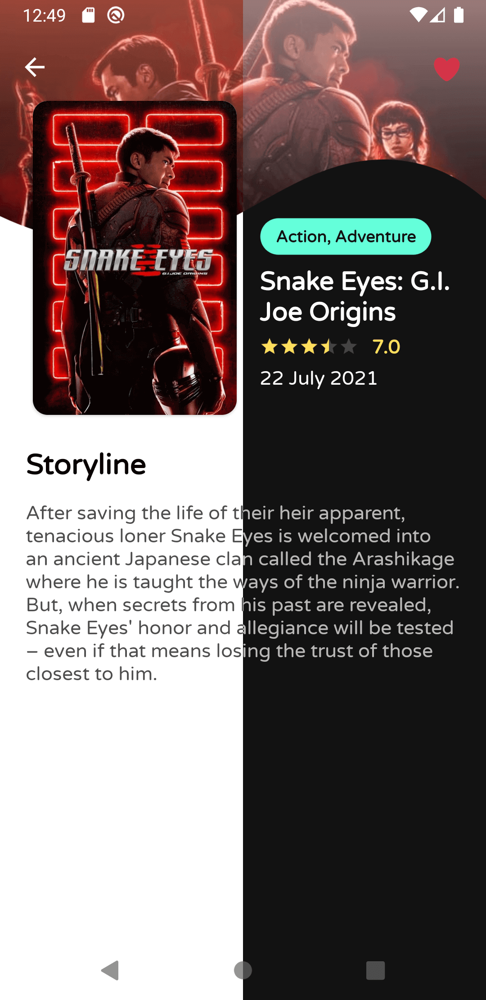

Movie Catalogue
=================

Movie catalog application that illustrates best practices for developing Android.
This repository contains detailed application examples that implement Clean Architecture with MVVM patterns using Modularization
Material Design, Night Mode, Data Binding, Retrofit2, Moshi, RxJava2, Dagger2, and Room. Classes have been designed in such a way that it could be inherited and maximize the code reuse.

Getting Started
---------------
This is the big picture, which should look familiar if you have been using Clean Architecture in your Android Applications.



The general principle is to use a basic 3 tiers architecture. The good thing about it, is that it is very easy to understand and many people are familiar with it.
So we will break down our solution into layers in order to respect the dependency rule (where dependencies flow in one direction: check above the rounded clean architecture graph):



### The MovieDB API key
Movie Catalogue uses [TheMovieDB API](https://api.themoviedb.org) to load a catalog of movies available on the screen.

Once you have the key, add this line to the `gradle.properties` file, either in your user home
directory (usually `~/.gradle/gradle.properties` on Linux and Mac) or in the project's root folder:

```
API_KEY = <YourMovieDB access key>
```

Screenshots
-----------
<p align="center">
  
  
  
</p>
<br>
<p align="center">
  
  
</p>
<br>

Libraries Used
--------------
* [AppCompat][0] - Degrade gracefully on older versions of Android.
* [Android KTX][1] - Write more concise, idiomatic Kotlin code.
* [Data Binding][2] - Declaratively bind observable data to UI elements.
* [Lifecycles][3] - Create a UI that automatically responds to lifecycle events.
* [LiveData][4] - Build data objects that notify views when the underlying database changes.
* [Room][5] - Access your app's SQLite database with in-app objects and compile-time checks.
* [ViewModel][6] - Store UI-related data that isn't destroyed on app rotations. Easily schedule
  asynchronous tasks for optimal execution.
* [Dagger2][7] - A compile-time framework for dependency injection.
* [Moshi][8] - A modern JSON library for Android and Java. It makes it easy to parse JSON into Java objects.
* [Retrofit2][9] - A type-safe HTTP client for Android and Java.
* [RxJava2][10] - A Java VM implementation of Reactive Extensions: a library for composing asynchronous and event-based programs by using observable sequences.
* [Coil][11] - An image loading library for Android backed by Kotlin Coroutines.
* [Lottie][12] - A mobile library for Android and iOS that parses Adobe After Effects animations exported as json with Bodymovin and renders them natively on mobile.
* [Shimmer Facebook][13] - An Android library that provides an easy way to add a shimmer effect to any view in your Android app.
* [Intuit Sdp][14] - An android SDK that provides a new size unit - sdp (scalable dp). This size unit scales with the screen size. It can help Android developers with supporting multiple screens.
* [Intuit Ssp][15] - An android SDK that provides a new size unit - ssp (scalable sp). This size unit scales with the screen size based on the sp size unit (for texts). It can help Android developers with supporting multiple screens.
* [Timber][16] - This is a logger with a small, extensible API which provides utility on top of Android's normal Log class.

[0]: https://developer.android.com/topic/libraries/support-library/packages#v7-appcompat
[1]: https://developer.android.com/kotlin/ktx
[2]: https://developer.android.com/topic/libraries/data-binding/
[3]: https://developer.android.com/topic/libraries/architecture/lifecycle
[4]: https://developer.android.com/topic/libraries/architecture/livedata
[5]: https://developer.android.com/topic/libraries/architecture/room
[6]: https://developer.android.com/topic/libraries/architecture/viewmodel
[7]: https://github.com/google/dagger
[8]: https://github.com/square/moshi
[9]: https://github.com/square/retrofit
[10]: https://github.com/ReactiveX/RxJava
[11]: https://github.com/coil-kt/coil
[12]: https://github.com/airbnb/lottie-android
[13]: https://github.com/facebook/shimmer-android
[14]: https://github.com/intuit/sdp
[15]: https://github.com/intuit/ssp
[16]: https://github.com/JakeWharton/timber

Additional resources
--------------------
Check out these pages to learn more about Clean Architecture:
- [Architecting Android...Reloaded](https://fernandocejas.com/2018/05/07/architecting-android-reloaded)

Noted
--------------------
Please use this as a reference only. Hope this helps you develop more projects.

License
--------------------
```
Copyright (C) 2020 Alfa Centaury Hidayatullah

   Licensed under the Apache License, Version 2.0 (the "License");
   you may not use this file except in compliance with the License.
   You may obtain a copy of the License at

       http://www.apache.org/licenses/LICENSE-2.0

   Unless required by applicable law or agreed to in writing, software
   distributed under the License is distributed on an "AS IS" BASIS,
   WITHOUT WARRANTIES OR CONDITIONS OF ANY KIND, either express or implied.
   See the License for the specific language governing permissions and
   limitations under the License.
```